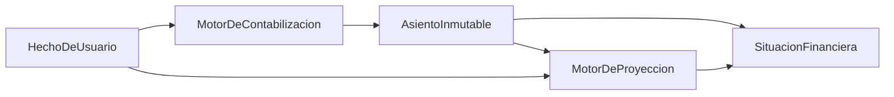

# Personal Finance Manager (`finanzas`)

## Decisiones senior (amplían el plan original)

| Tema | Decisión |
|------|----------|
| Corrección contable | Solo `revertir()`; origen del reverso = `reverso:{origen}`; auditado en `seguridad_logs` |
| Unicidad de asiento | Unique DB `(usuario_id, origen_tipo, origen_id)` + guard en servicio |
| Metas | Avance = Σ `aporte_meta` (transferencia a bolsillo). Sin “monto actual” editable |
| Abono extra préstamo | Pago ≥ cuota; exceso reduce **plazo**, mantiene cuota |
| Intereses en situación | Leídos de movimientos `5200` (libro), no del calendario |
| Dependencias | Sin Sanctum/TTS/FPDF/DomPDF hasta que haya reportes reales |
| Tests | PHPUnit con SQLite `:memory:`; dominio + IDOR obligatorios |

Proyecto de referencia: [`/Users/angelpenaloza/Documents/GitHub/ambientes`](/Users/angelpenaloza/Documents/GitHub/ambientes) (PedNia). Guía de agentes: [`AGENTS.md`](/Users/angelpenaloza/Documents/GitHub/ambientes/AGENTS.md).

**Misma arquitectura (no el dominio escolar):**

- Laravel 10, PHP 8.1+, MySQL, Eloquent, migraciones
- UI **Blade + Bootstrap 5 + jQuery** (no SPA, no Vue/React/Livewire)
- Lógica de negocio en `app/Services` (controladores delgados)
- JS por pantalla en `public/assets/js`, layouts Blade, rutas nombradas
- Auth por **sesión** (Sanctum eliminado del producto hasta API real)
- Auditoría vía `App\Services\SeguridadService` → `seguridad_logs`
- PDF solo cuando existan reportes (paquete no instalado hoy)
- PHPUnit (`tests/Unit` + `tests/Feature`) con SQLite en memoria
- Idioma de código y UI: **español**
- Validación con Form Requests en flujos nuevos
- Guía local: [`AGENTS.md`](../../AGENTS.md)

**No se copia:** kiosco/PIN, sync entre nodos, multi-institución, roles admin/docente/superAdmin escolares, `AMBIENTE_SLUG`.

**Ubicación:** [`/Users/angelpenaloza/Documents/GitHub/finanzas`](/Users/angelpenaloza/Documents/GitHub/finanzas). Al ejecutar: `create_project` → `move_agent_to_root` **antes** de scaffolding.

---

## Decisiones ya cerradas

| Tema | Decisión |
|------|----------|
| Usuarios | Multi-usuario; cada persona tiene su propio libro; aislamiento por `usuario_id` |
| Moneda | COP, zona `America/Bogota`; una sola moneda |
| Libro | Híbrido: hechos de usuario + asientos automáticos inmutables |
| Entrada | Manual + importación CSV/Excel (fase 1); sin Open Finance |
| Entrega | Arquitectura completa; implementar primero el **núcleo** |

**Decisiones menores (buenas prácticas, sin preguntar):**

- Montos en **centavos enteros** (`BIGINT`) para evitar errores de punto flotante; UI en pesos.
- Tasas de crédito/préstamo se capturan como **EA %**; internamente se convierte a tasa periódica.
- Amortización de préstamos: **sistema francés** (cuota fija), el más habitual en Colombia.
- Tarjeta: fecha de **corte**, fecha de **pago**, cupo, compras de contado vs **cuotas**, saldo revolving sobre lo no pagado al corte.
- “Dinero comprometido” = cuotas e intereses **ya programados** en el horizonte (mes o 30 días) + metas de ahorro con aporte planificado. No incluye cupo no usado.
- Saldos de cuentas y deudas **nunca** se editan a mano como fuente de verdad: se derivan del libro (salvo saldo inicial de apertura, que genera un asiento de opening).
- Auth: email + contraseña, sesión Laravel, policies por recurso, rate-limit de login.

---

## Arquitectura financiera (no es un CRUD)

Tres capas de datos:

1. **Hechos de usuario** (mutables con reglas): ingreso, gasto, transferencia, compra con tarjeta, pago, presupuesto, meta, préstamo, tarjeta, importación.
2. **Libro** (append-only): cada hecho postea un asiento (`asientos` + `movimientos`) contra un plan de cuentas del usuario. Corrección = **asiento inverso + nuevo asiento**, nunca `UPDATE` de montos posteados.
3. **Proyección** (derivada, no contable): calendario de cuotas, ingresos recurrentes, presupuestos; alimenta alertas y simulaciones **sin escribir el libro** hasta que el usuario registra el hecho.

El dashboard no lee tablas CRUD: consulta un servicio `SituacionFinancieraService` que responde las 13 preguntas sobre libro + proyección.

---

## Modelo de datos (núcleo)

Aislamiento: todas las tablas de dominio llevan `usuario_id` + índices compuestos. Global scope o policy en cada modelo.

**Identidad:** `users` (email único, password).

**Cuentas y catálogo**

- `cuentas_contables`: activo (banco, efectivo, billetera), pasivo (préstamo, tarjeta), patrimonio, ingreso, gasto. Semilla por usuario al registrarse.
- `cuentas_liquidas`: banco/efectivo visibles; ligadas a una cuenta contable de activo. Saldo inicial + asientos.
- `categorias`: ingreso/gasto, padre opcional, mapeo a cuenta de resultado.

**Libro**

- `asientos`: `fecha`, `origen_tipo`/`origen_id` (hecho), `descripcion`, hash de integridad opcional.
- `movimientos`: `asiento_id`, `cuenta_contable_id`, `debe_centavos`, `haber_centavos`. Constraint: suma debe = suma haber.

**Obligaciones**

- `prestamos`: principal, EA, plazo, fecha desembolso, día de pago, estado. El desembolso postea: Debe líquido / Haber pasivo.
- `cuotas_prestamo`: calendario (capital, interés, saldo); pago real postea: Debe pasivo + Debe gasto interés / Haber líquido.
- `tarjetas_credito`: cupo, corte, pago, EA compras/avances.
- `compras_tarjeta`: monto, cuotas, tasa; genera `cuotas_tarjeta`.
- `ciclos_facturacion`: saldo al corte, pago mínimo, intereses del ciclo (cuando se implemente el motor de revolving).
- `pagos`: hecho unificado (a préstamo, tarjeta o proveedor); el motor reparte capital/interés.

**Presupuesto, metas, recurrencias**

- `presupuestos` + `presupuesto_lineas` (mes, categoría, tope).
- `metas_ahorro`: objetivo, fecha, aporte periódico; opcional cuenta destino.
- `recurrencias`: ingresos/gastos esperados (no son asientos hasta confirmarse o hasta “registrar ocurrencia”).

**Importación y auditoría**

- `importaciones`: archivo, mapeo de columnas, estado, errores por fila.
- `seguridad_logs`: login, cambios de obligaciones, correcciones de asientos, importaciones.

Simulaciones y alertas quedan **diseñadas** (servicios + tablas `simulaciones`, `alertas` en migración posterior), no en el núcleo de UI.

---

## Motor de dominio (servicios)

| Servicio | Responsabilidad |
|----------|-----------------|
| `ContabilizacionService` | Postear asientos atómicos; opening; reversos |
| `TesoreriaService` | Ingresos, gastos, transferencias entre líquidos |
| `PrestamoService` | Alta, calendario francés, abono extraordinario (recalcula cuotas futuras) |
| `TarjetaService` | Compras, cuotas, pagos, cupo disponible |
| `PresupuestoService` | Consumo vs tope a partir de gastos posteados del mes |
| `MetaAhorroService` | Avance = aportes posteados a la meta |
| `ProyeccionService` | Flujo de caja: hechos futuros + cuotas + recurrencias |
| `SituacionFinancieraService` | Las 13 preguntas (ver abajo) |
| `ImportacionExtractoService` | CSV/Excel → hechos + asientos; idempotencia por hash de fila |
| `SimulacionService` | (arquitectura) clona calendario en memoria; no toca el libro |
| `AlertaService` | (arquitectura) reglas sobre proyección: corte, presupuesto, meta |

**Definiciones de las 13 preguntas (núcleo):**

1. ¿Cuánto tengo? — suma saldos de cuentas líquidas (libro).
2. ¿Cuánto debo? — saldos de pasivos (préstamos + tarjetas).
3. ¿Cuánto voy a recibir? — recurrencias de ingreso + ingresos proyectados en el horizonte (mes).
4. ¿Cuánto tengo comprometido? — pagos programados del horizonte + aportes de metas.
5. ¿Cuánto voy a gastar este mes? — gastos ya posteados + gastos recurrentes + cuotas del mes.
6. ¿Cuánto debo pagar próximamente? — próximas N obligaciones ordenadas por fecha.
7. ¿Cuánto estoy pagando en intereses? — movimientos de gasto “interés” en el periodo.
8. ¿Qué deuda tiene mayor costo? — ranking por EA efectiva / interés restante del calendario.
9. ¿Cuánto puedo ahorrar? — ingreso proyectado − gastos/cuotas del mes − mínimos de tarjeta (capacidad, no promesa).
10. ¿Puedo asumir una nueva deuda? — (núcleo: indicador de capacidad; UI de simulador en fase 2).
11. ¿Abono extraordinario? — (núcleo: método en `PrestamoService`; UI completa en fase 2).
12. ¿Cuándo termino de pagar? — última cuota vigente de cada obligación.
13. ¿Cómo evoluciona? — serie mensual patrimonio / liquidez / deuda (desde el libro).

### Fase 12 — Motor de análisis financiero

- **Tasa de ahorro:** `(ingresos reales - gastos reales - pagos de deuda) / ingresos reales × 100`.
- **Nivel de endeudamiento:** `deuda total / saldo actual de cuentas × 100`. Mide cuánto representan los pasivos frente a la liquidez contable; no es un porcentaje de ingresos.
- **Ingresos comprometidos:** `(cuotas pendientes + gastos proyectados) / ingresos proyectados × 100`. Incluye obligaciones y salidas previstas del horizonte mensual.
- **Dinero comprometido:** cuotas pendientes más aportes planificados a metas. Los gastos proyectados se exponen por separado porque no son deuda hasta registrarse.
- **Dinero disponible real:** saldo actual de cuentas menos cuotas, metas y gastos proyectados pendientes del horizonte. Puede ser negativo y representa un déficit de cobertura.

### Fase 13 — Proyecciones

La proyección mensual es una capa separada del libro: combina ingresos y gastos recurrentes activos, cuotas futuras pendientes y pagos futuros no vinculados a deuda. No crea asientos ni altera saldos reales. Las cuotas de préstamos y tarjetas se muestran como **deudas programadas**; los pagos especializados de deuda no se vuelven a restar para evitar duplicar la salida.

### Fase 14 — Alertas

Las reglas viven en `AlertaService` y devuelven alertas normalizadas con nivel, título y mensaje; la interfaz solo las presenta. Se evalúan pagos próximos y vencidos, presupuestos excedidos, utilización de tarjetas desde 80%, variaciones mensuales de gastos e ingresos superiores al 20%, flujo negativo y endeudamiento desde 50%.

### Reglas de negocio

El catálogo completo de invariantes financieras, validaciones de dominio y
aislamiento multiusuario está documentado en
[`docs/reglas-negocio.md`](../../docs/reglas-negocio.md). Las reglas críticas
se aplican en `TesoreriaService`, `PagoService`, `TarjetaService` y
`ContabilizacionService`, antes de persistir hechos o asientos.

---

## Backend y frontend (estilo ambientes)

- Rutas `routes/web.php` con nombres `auth.*`, `app.*`. Middleware `auth` + policies.
- Controladores: `Auth\`, `App\` (dashboard, cuentas, movimientos, deudas, tarjetas, presupuestos, metas, reportes, importación).
- Layout único `layouts/app` (sidebar: Situación, Cuentas, Movimientos, Deudas, Tarjetas, Presupuestos, Metas, Flujo, Reportes, Importar).
- Dashboard UX: **cuatro bloques** — Tengo / Debo / Comprometido / Proyectado — y detalle expandible a cada pregunta. Lenguaje en pesos colombianos, sin jerga contable en la UI (“asiento” no se muestra al usuario).
- Formularios de movimiento: tipo, cuenta, categoría, fecha, monto; el servidor postea el libro.
- Deudas/tarjetas: ficha con calendario y costo, no una tabla de campos.

---

## Seguridad

- Tenancy estricto: tests de que usuario A no ve IDs de B (IDOR).
- CSRF, cookies `httpOnly`, `hashed` passwords, throttle login.
- Subida CSV: MIME/tamaño, parseo en servidor, sin eval; no loguear extractos completos.
- Correcciones financieras auditadas.
- Headers básicos (`X-Frame-Options`, etc. vía middleware Laravel).
- Sin secretos en git; `.env.example` limpio.

---

## QA (el valor está en las pruebas de dominio)

Antes de UI amplia, tests unitarios con casos fijos:

- Asiento descuadrado se rechaza.
- Ingreso/gasto/transferencia cuadran y mueven liquidez.
- Calendario francés: capital + interés = cuota; saldo final 0.
- Abono extra reduce plazo o cuota según regla documentada (definir en código: **reduce plazo, mantiene cuota**).
- Compra a 3 cuotas no aumenta liquidez; aumenta pasivo y genera calendario.
- Pago de tarjeta reduce pasivo y liquidez.
- Presupuesto consume solo gastos posteados de esa categoría/mes.
- Feature: aislamiento multi-usuario.

---

## Alcance de implementación (tras aprobar el plan)

**Fase 1 (este trabajo):** bootstrap Laravel 10 en `finanzas`, AGENTS.md del producto, migraciones + modelos + motor de libro, auth, cuentas, movimientos, préstamos, tarjetas (compra/pago/cuotas), presupuestos, metas, recurrencias básicas, dashboard de situación, importación CSV, tests de dominio, UI Blade coherente.

**Fuera de la primera entrega (queda diseñado):** motor fino de revolving de tarjeta al corte, alertas programadas (queue/scheduler), UI de simulador de nueva deuda y escenarios, reportes PDF, Open Finance.

---

## Riesgos aceptados

- Intereses de tarjeta revolving en Colombia varían por entidad; el núcleo usará EA de la tarjeta y un modelo simple de interés sobre saldo no pagado al corte. Refinar por emisor sería un requisito nuevo.
- UVR, libranzas y leasing quedan fuera hasta que se pidan.
